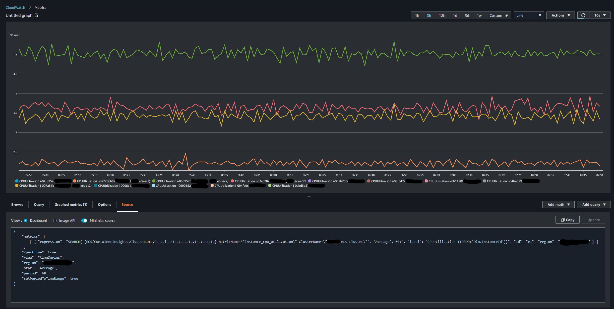
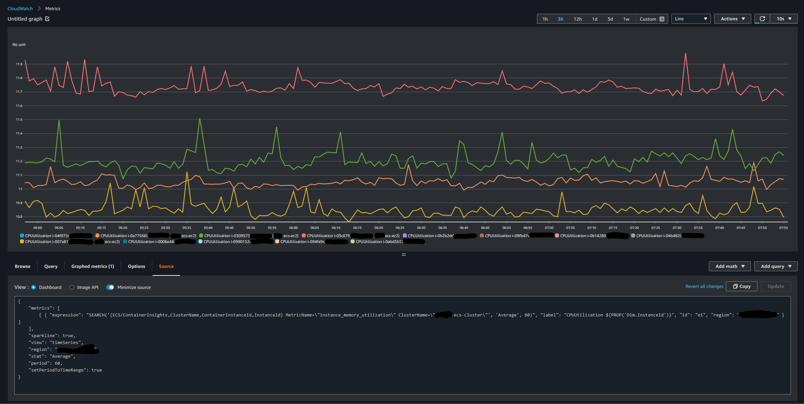

# ECS Infrastructure Monitoring

## Each Instances' CPU Utilization

```
SEARCH('{ECS/ContainerInsights,ClusterName} MetricName=\"instance_cpu_utilization\" ClusterName=\"<CLUSTER NAME>\"', 'Average', 60)
```



## Each Instances' Memory Utilization

```
SEARCH('{ECS/ContainerInsights,ClusterName,ContainerInstanceId,InstanceId} MetricName=\"instance_memory_utilization\" ClusterName=\<CLUSTER NAME>\"', 'Average', 60)
```



## Each Instances' 