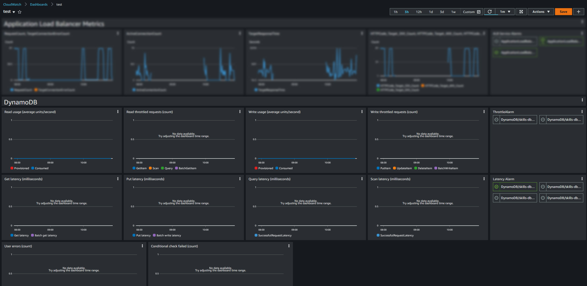
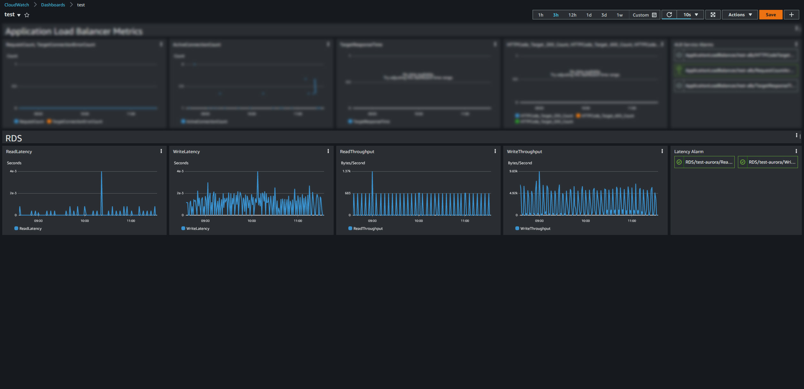
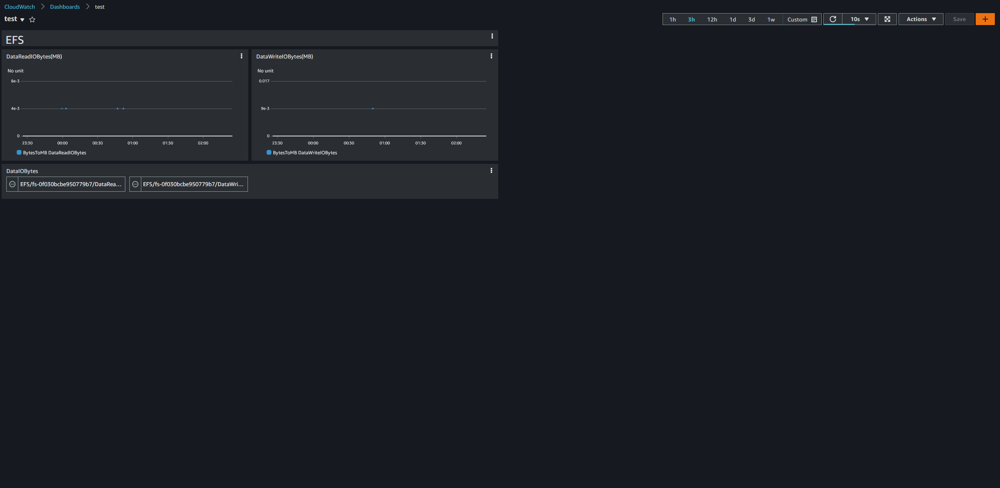

# [Service](../)

## ELB


- RequestCount
- TargetConnectionErrorCount
- TargetResponseTime
- ActiveConnectionCount
- HTTPCode_Target_2XX_Count
- HTTPCode_Target_4XX_Count
- HTTPCode_Target_5XX_Count

### Get the alarm's ARN

``` shell
RequestCountAnomaly_ALARM_ARN="[ALARM ARN]"
HTTPCode_Target_5XX_Count_ALARM_ARN="[ALARM ARN]"
TargetResponseTime_ALARM_ARN="[ALARM ARN]"
```

**If you created ALB CloudWatch Alarms in [HERE](../../alarm/alb/) using CloudFormation, You can use below code.**

``` shell
CLOUDFORMATION_STACK_NAME="[CLOUDFORMATION STACK NAME]"
REGION="[REGION CODE]"

JSON=$(aws cloudformation describe-stacks \
    --stack-name $CLOUDFORMATION_STACK_NAME \
    --region $REGION \
    --query 'Stacks[0].Outputs' \
)

RequestCountAnomaly_ALARM_ARN=$(echo $JSON | jq -rc '[ .[] | select ( .OutputKey | contains ("RequestCountAnomalyAlarmArn") ) ][0].OutputValue')
HTTPCode_Target_5XX_Count_ALARM_ARN=$(echo $JSON | jq -rc '[ .[] | select ( .OutputKey | contains ("HTTPCodeTarget5XXCountAlarmArn") ) ][0].OutputValue')
TargetResponseTime_ALARM_ARN=$(echo $JSON | jq -rc '[ .[] | select ( .OutputKey | contains ("TargetResponseTimeAlarmArn") ) ][0].OutputValue')
```

### Create Dashboard JSON

``` shell
ALB_NAME="[APPLICATION LOAD BALANCER NAME]"
REGION="[REGION CODE]"

ALB_ARN=$(aws elbv2 describe-load-balancers \
    --names $ALB_NAME \
    --query 'LoadBalancers[0].LoadBalancerArn' \
    --region $REGION \
    --output text | \
    cut -d '/' -f2-4)

sed -i "s|ALB_ARN|$ALB_ARN|g" alb.json
sed -i "s|REGION|$REGION|g" alb.json
sed -i "s|RequestCountAnomaly_ALARM_ARN|$RequestCountAnomaly_ALARM_ARN|g" alb.json
sed -i "s|HTTPCode_Target_5XX_Count_ALARM_ARN|$HTTPCode_Target_5XX_Count_ALARM_ARN|g" alb.json
sed -i "s|TargetResponseTime_ALARM_ARN|$TargetResponseTime_ALARM_ARN|g" alb.json
```

## DynamoDB



- Usage and throttling
  - Read usage
  - Read throttled requests
  - Write usage
  - Write throttled requests
- Latency
  - Get latency
  - Put latency
  - Query latency
  - Scan latency
- Errors
  - User errors
  - Conditional check failed

### Get the alarm's ARN

``` shell
ReadThrottleAlarm_ALARM_ARN="[ALARM ARN]"
WriteThrottleError_ALARM_ARN="[ALARM ARN]"
ScanLatencyAlarm_ALARM_ARN="[ALARM ARN]"
QueryLatencyAlarm_ALARM_ARN="[ALARM ARN]"
PutLatencyAlarm_ALARM_ARN="[ALARM ARN]"
GetLatencyAlarm_ALARM_ARN="[ALARM ARN]"
```

**If you created ALB CloudWatch Alarms in [HERE](../../alarm/dynamodb/) using CloudFormation, You can use below code.**

``` shell
CLOUDFORMATION_STACK_NAME="[CLOUDFORMATION STACK NAME]"
REGION="[REGION CODE]"

JSON=$(aws cloudformation describe-stacks \
    --stack-name $CLOUDFORMATION_STACK_NAME \
    --region $REGION \
    --query 'Stacks[0].Outputs' \
)

ReadThrottleAlarm_ALARM_ARN=$(echo $JSON | jq -rc '[ .[] | select ( .OutputKey | contains ("ReadThrottleAlarmArn") ) ][0].OutputValue')
WriteThrottleError_ALARM_ARN=$(echo $JSON | jq -rc '[ .[] | select ( .OutputKey | contains ("WriteThrottleAlarmArn") ) ][0].OutputValue')
ScanLatencyAlarm_ALARM_ARN=$(echo $JSON | jq -rc '[ .[] | select ( .OutputKey | contains ("ScanLatencyAlarmArn") ) ][0].OutputValue')
QueryLatencyAlarm_ALARM_ARN=$(echo $JSON | jq -rc '[ .[] | select ( .OutputKey | contains ("QueryLatencyAlarmArn") ) ][0].OutputValue')
PutLatencyAlarm_ALARM_ARN=$(echo $JSON | jq -rc '[ .[] | select ( .OutputKey | contains ("PutLatencyAlarmArn") ) ][0].OutputValue')
GetLatencyAlarm_ALARM_ARN=$(echo $JSON | jq -rc '[ .[] | select ( .OutputKey | contains ("GetLatencyAlarmArn") ) ][0].OutputValue')
```

### Create Dashboard JSON

``` shell
DYNAMODB_TABLE_NAME="[DYNAMODB TABLE NAME]"
REGION="[REGION CODE]"

sed -i "s|DYNAMODB_TABLE_NAME|$DYNAMODB_TABLE_NAME|g" dynamodb.json
sed -i "s|REGION|$REGION|g" dynamodb.json
sed -i "s|ReadThrottleAlarm_ALARM_ARN|$ReadThrottleAlarm_ALARM_ARN|g" dynamodb.json
sed -i "s|WriteThrottleError_ALARM_ARN|$WriteThrottleError_ALARM_ARN|g" dynamodb.json
sed -i "s|ScanLatencyAlarm_ALARM_ARN|$ScanLatencyAlarm_ALARM_ARN|g" dynamodb.json
sed -i "s|QueryLatencyAlarm_ALARM_ARN|$QueryLatencyAlarm_ALARM_ARN|g" dynamodb.json
sed -i "s|PutLatencyAlarm_ALARM_ARN|$PutLatencyAlarm_ALARM_ARN|g" dynamodb.json
sed -i "s|GetLatencyAlarm_ALARM_ARN|$GetLatencyAlarm_ALARM_ARN|g" dynamodb.json
```

## RDS



- Latency
  - Read latency
  - Write latency
- Throughput
  - Read throughput
  - Write throughput

## EFS



- Data write IO bytes
- Data read IO bytes
- [Alarms](../../alarm/efs/)

### Data Write IO Bytes

``` json
{
    "metrics": [
        [ { "expression": "METRICS()/1000000", "label": "BytesToMB", "id": "e1", "region": "[REGION]" } ],
        [ "AWS/EFS", "DataWriteIOBytes", "FileSystemId", "[FILE SYSTEM ID]", { "id": "m1", "visible": false, "region": "[REGION]" } ]
    ],
    "view": "timeSeries",
    "stacked": false,
    "region": "[REGION]",
    "stat": "Sum",
    "period": 60,
    "title": "DataWriteIOBytes(MB)"
}
```

### Data Read IO Bytes

``` json
{
    "metrics": [
        [ { "expression": "METRICS()/1000000", "label": "BytesToMB", "id": "e1", "region": "[REGION]" } ],
        [ "AWS/EFS", "DataReadIOBytes", "FileSystemId", "[FILE SYSTEM ID]", { "id": "m1", "visible": false, "region": "[REGION]" } ]
    ],
    "view": "timeSeries",
    "stacked": false,
    "region": "[REGION]",
    "stat": "Sum",
    "period": 60,
    "title": "DataReadIOBytes(MB)"
}
```